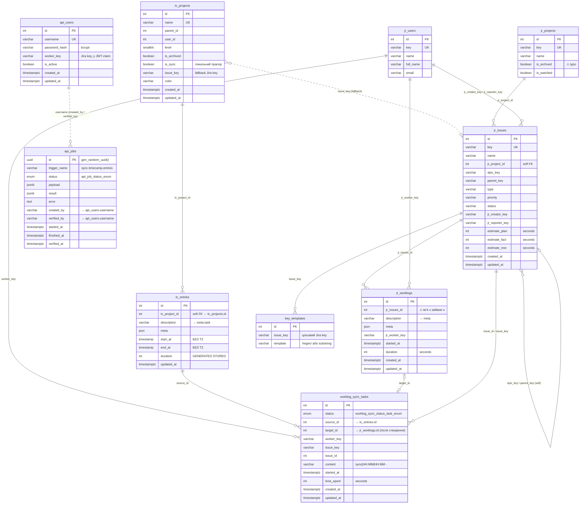
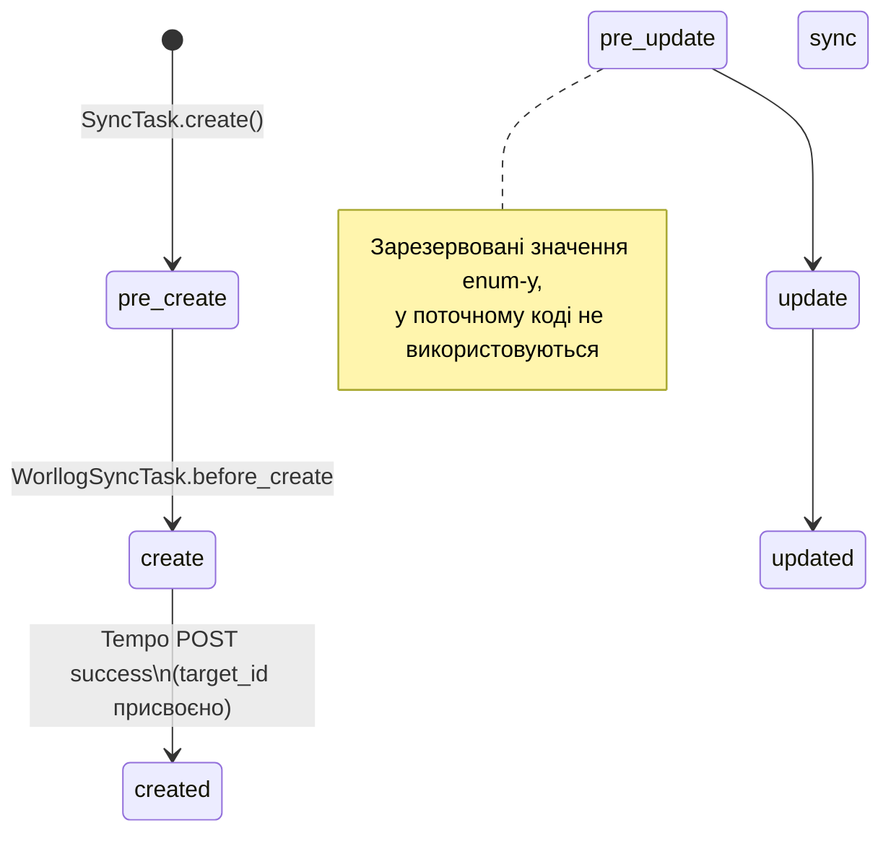
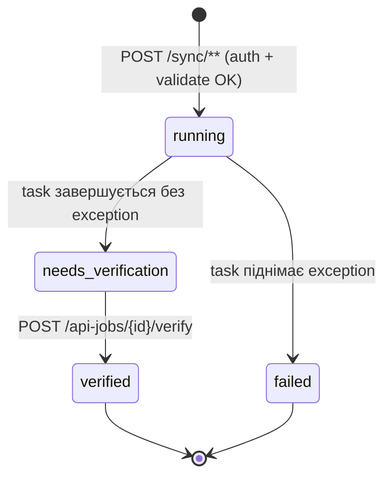

# Database — ER Diagrams (Mermaid)

Візуальний компаньйон до [schema.md](schema.md). Усі діаграми — Mermaid,
рендеряться напряму в GitHub-preview, PyCharm Markdown plugin і Obsidian.

> **FK constraint-ів у БД нема.** Стрілки нижче — це **логічні** зв'язки,
> що тримаються кодом (DAO, event-listeners, ручні join-и). Деталі — §8
> у [schema.md](schema.md).

---

## 1. Entity-Relationship Diagram

Усі 8 доменних таблиць + 2 API-таблиці. Системна `alembic_version` опущена.



### Легенда кардинальностей

| Notation        | Зміст                                   |
| --------------- | --------------------------------------- |
| `\|\|--o{`       | 1 обов'язкове → 0..N                    |
| `\|o--o\|`       | 0..1 → 0..1                             |
| `}o--o\|`        | 0..N → 0..1                             |
| `}o..o\|` (--..--) | м'який зв'язок через текстовий key (не id) |

---

## 2. Потік даних (data flow)

Хто наповнює які таблиці, і куди витікає synced worklog.

```mermaid
flowchart LR
    TC[TimeCamp API]
    JR[Jira API]
    TEMPO[Tempo API]

    subgraph TC_domain["TimeCamp домен"]
        tcp[(tc_projects)]
        tce[(tc_entries)]
        kt[(key_templates)]
    end

    subgraph JR_domain["Jira домен"]
        jrp[(jr_projects)]
        jru[(jr_users)]
        jri[(jr_issues)]
        jrw[(jr_worklogs)]
    end

    subgraph SYNC["Sync домен"]
        wst[(worklog_sync_tasks)]
    end

    TC -- "GET tasks"   --> tcp
    TC -- "GET entries" --> tce

    JR -- "api/2/project" --> jrp
    JR -- "api/2/search"  --> jri
    JR --                 --> jru

    TEMPO -- "GET worklogs"  --> jrw
    wst   -- "POST worklog (Tempo)" --> TEMPO
    TEMPO -- "id у відповіді" --> wst

    tce -. "source_id" .-> wst
    jrw -. "target_id" .-> wst
    jri -. "issue_id / issue_key" .-> wst

    tce -. "description → meta.task" .-> kt
    kt  -. "match issue_key" .-> tce

    tcp -. "is_sync=TRUE filter" .-> wst
```

Суцільні стрілки — реальні HTTP-виклики або writes у БД. Пунктирні —
логічні зв'язки/lookups усередині застосунку.

---

## 3. State machine — `worklog_sync_status_task_enum`



Деталі переходів — `src/models/worklog_sync_task.py` + хук
`WorllogSyncTask.before_create` / `create_worklogs`.

---

## 3a. State machine — `api_job_status_enum`



`verified` і `failed` — final-стани. Із `needs_verification` повторити синк
не можна — для повтору викликається той самий sync-endpoint, що створює нову
job-row. Деталі — `src/api/jobs_wrapper.py` + `src/dao/api_job_dao.py`.

---

## 4. Як рендерити

- **GitHub** — рендерить Mermaid автоматично в `.md` файлах.
- **PyCharm** — потрібен plugin **Mermaid** (Settings → Plugins). Після
  встановлення Markdown-превʼю показує діаграми.
- **Obsidian / VS Code** — теж є вбудована підтримка.
- **CLI/export** — `mmdc -i erd.md -o erd.svg` (npm-пакет
  `@mermaid-js/mermaid-cli`).

Не редагуй PNG/SVG експорти руками — джерело завжди тут, у `.md`.
